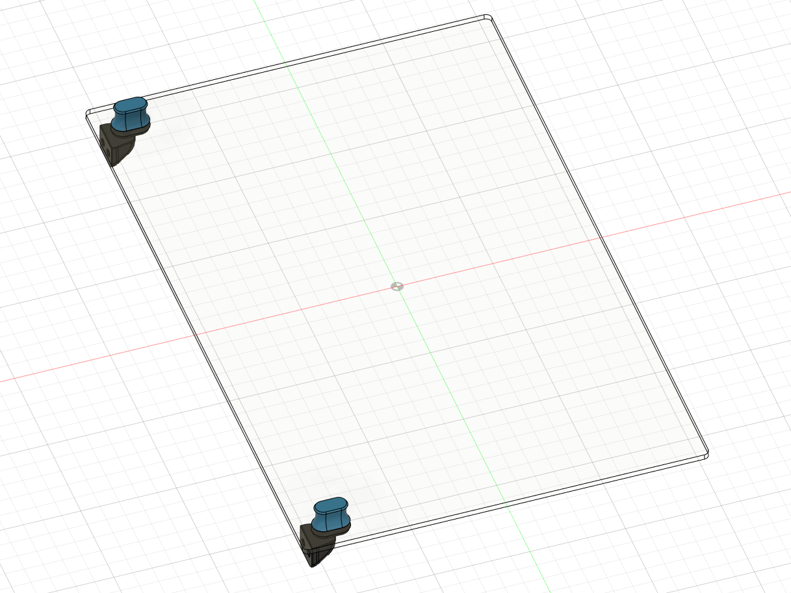
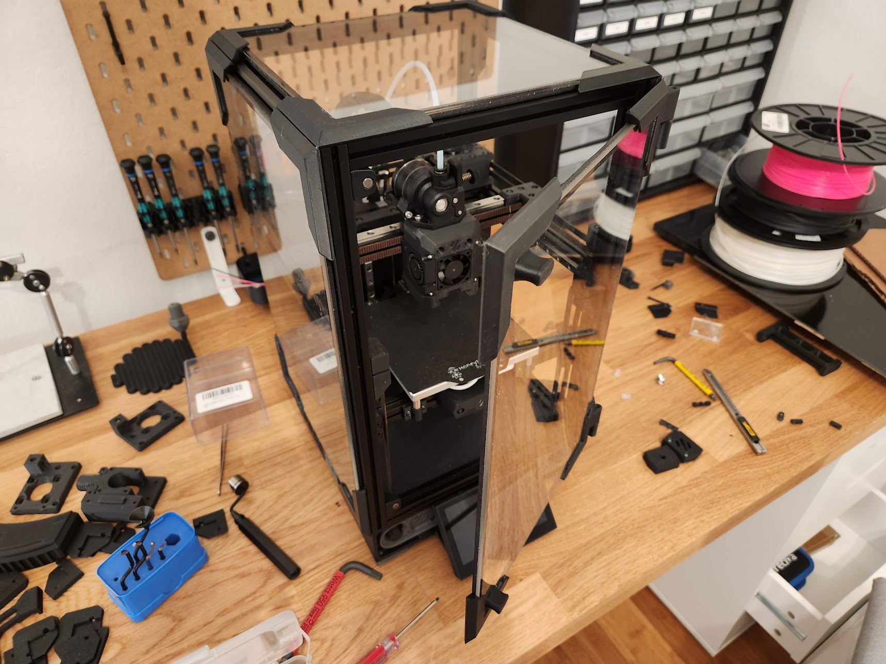

# BoxZero Annex Handles

This mod adds Annex K3 style handles to the BoxZero door.

It is designed to work with V3 version of [ZeroPanels](https://github.com/zruncho3d/ZeroPanels), with 3mm foam on the inside.

## Hardware

* 4x 3x5x4 heatset inserts
* 4x M3x8 FHCS **ferrous** screws
* 4x M3x8 BHCS screws
* 4x M3 nuts
* 2x 6x3mm magnets, preferably N52

## Drilling holes in the door

This mod uses ferrous FHCS screws to keep the door closed against magnets and to secure the handles on. As such, there need to be four M3 clearance holes drilled into the door.

A printed jig is included in the STLs to align the holes.

**When drilling acrylic, be sure to use a proper plastic drill bit to avoid cracking plastic.**

Alternatively, a DXF is provided with holes in place.

## Block thickness

The thickness of the "block" determines the holding strength of the door by moving the FHCS screws closer or further from the magnets. If the block is too thin, then the holding power is weak, but if the block is too thick, then there is risk of creating a gap between the door and extrusions.

By default, the block is 2.5mm thick, which should provide decent holding power while also not creating a gap. There is a parametric CAD supplied so that this value can be adjusted.

## Photo

