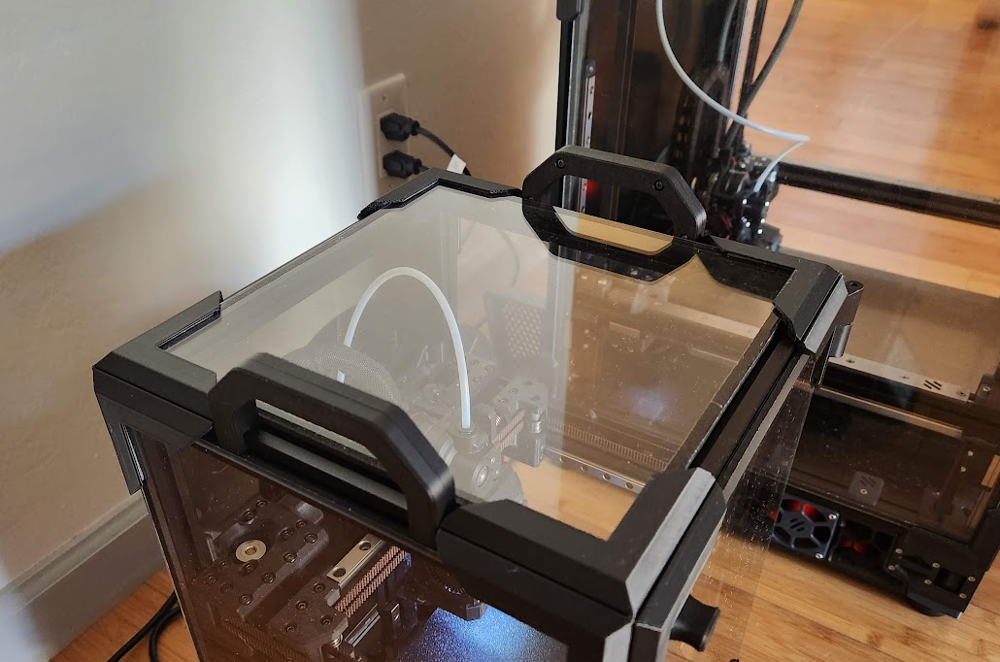

# BoxZero Handles

These are handles meant for a [BoxZero](https://github.com/zruncho3d/BoxZero) that are compatible with [ZeroPanels](https://github.com/zruncho3d/ZeroPanels). They are 100mm long and do not interfere with the ability to snap the top and side panels off and on.

## Hardware

* 8x M3x5x4 heatset insert
* 8x M3x8 BHCS

## Assembly

1. Remove top panel to expose holes for lower 2 screws
2. Press heatset inserts into the 4 pockets in the outer half
3. Slide inner half into the top of a top extrusion
4. Slide outer half into the side of a top extrusion
5. Fasten the two halves together with 4 M3x8 BHCS screws
6. Repeat for other handle
7. Put top panel back on
