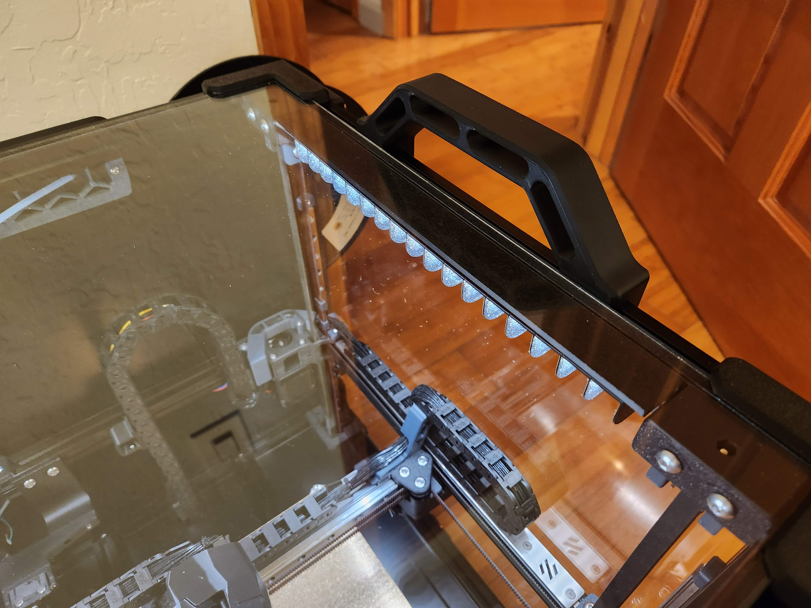

# Daylight Stick Mount

This is a mount for [Daylight on a Stick](https://github.com/VoronDesign/Voron-Hardware/tree/master/Daylight), specifically for 250mm printers. It incorporates the baffle design from Vector3D's [Daybreak Neo](https://github.com/AdamV3D/V3D-Voron-Mods/tree/main/Daylight_on_a_Stick/Mounts/V2.4/V2) PCBs and creates a mount that covers the entire PCB.

## BOM

For each Daylight on a Stick, this requires:

* 14 baffle pieces
* 1 mount
* 2x M3x5x4 heatset inserts
* 2x M3x6 BHCS or SHCS for attaching PCB to the mount
* 2x M3x6 BHCS for attaching mount to a 2020 extrusion
* 2x M3 Hammerhead or T-Nut

## Considerations

Due to the size of the mount (273mm long), it is very likely for the part to warp. Additionally, ABS shrinkages may affect dimensions, so it will likely be necessary to scale the mount in the slicer.
