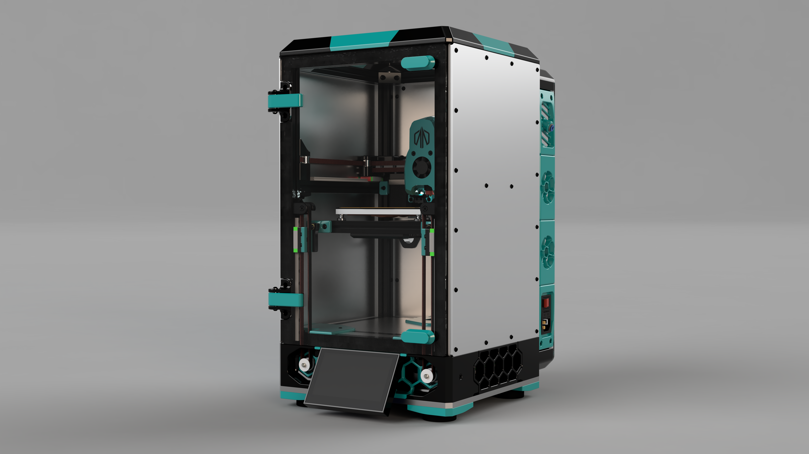

# Pandora's Summit

Pandora's Summit is a modification of [Pandora's Box](https://github.com/MasturMynd/Pandoras_Box) to use an enclosure and backpack inspired by the [Annex Engineering K3](https://github.com/Annex-Engineering/Gasherbrum-K3).

It features:
* Structural aluminum side and back panels
* Aluminum deck panel
* Magnetic tophat for easy removal
* Backpack with magnetic panel for easy maintenance
* Optional steel bottom panel for added stability
* Optional Waveshare 4.3" display

[Video of Pandora's Summit in action](https://www.youtube.com/watch?v=cPxTQcIu9fQ)
