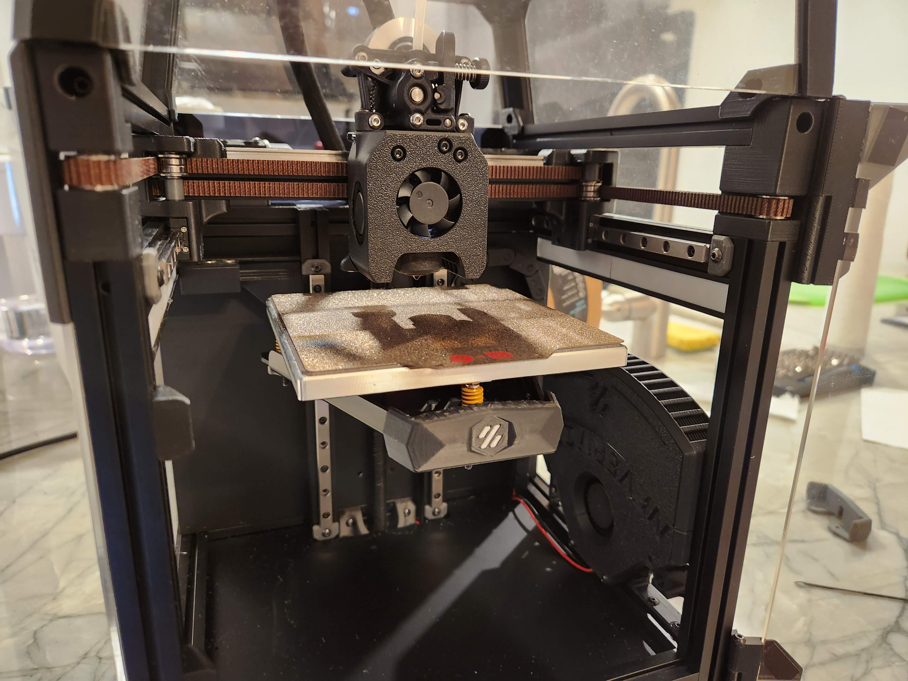
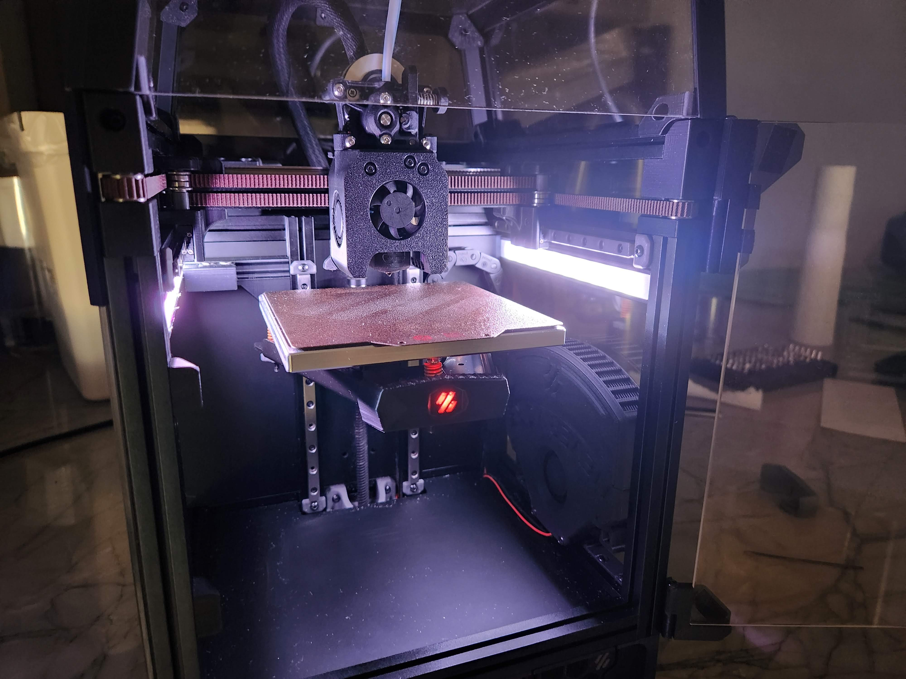

# Rainbow Matchstick Mount

This is an alternative mount for [Rainbow on a Matchstick](https://github.com/VoronDesign/Voron-Hardware/tree/master/Daylight) for the V0.1. This mount:

* Hides the PCB completely
* Includes a diffuser that can be printed out of natural or white filament
* Snaps in and out of 1515 extrusions

## Printing

Each of the 4 mount pieces should be printed as oriented. There is a built in brim at the bottom of each piece that should be removed after printing.

The 1515 extrusion snaps may print cleaner with Arachne perimeter generation.

## Assembly

Each piece takes an M3x5x4 heatset insert that the PCBs mount to. The diffusers slide into the slot in each piece.

## CAD parameters

As 1515 extrusions all differ slightly, a parametric CAD file is included to adjust tolerances to fit your needs.
