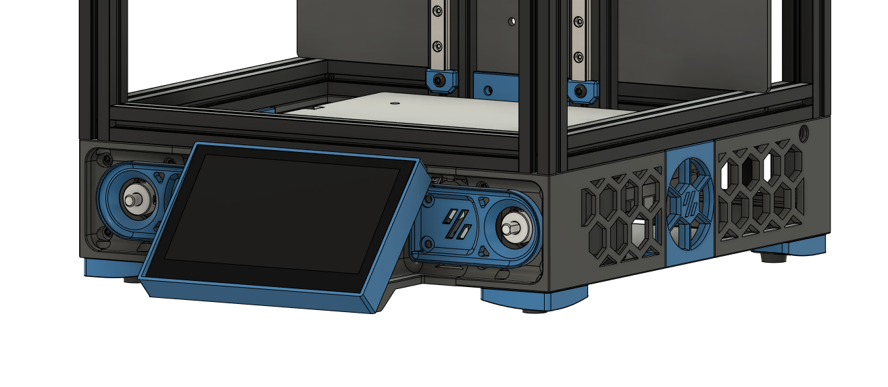

# Tri-Zero Waveshare 4.3" Skirt

This is a skirt mod for the [Tri-Zero](https://github.com/zruncho3d/tri-zero) printer derived heavily from [hbo's skirt mod](https://github.com/zruncho3d/tri-zero/tree/main/Mods/hbo/SkirtsCollection).

The changes in this skirt mod compared to the original mod are:

* Low profile feet: Reuse your original V0 feet!
* Bottom panel: Covers up the PSU.
* Inset Waveshare 4.3" display: Pushes the display further back into the skirt.
* Alternate pulley covers: Not really a cover per se. Exposes the pulley a la V2.4.

## Requirements

* NEMA17 Z motors only
* Secondary MCU may not fit if taped onto the PSU
* Uses a Waveshare 4.3" Capacitive Touch Screen

## Print settings

Standard Voron print settings:

* 0.4mm extrusion width
* 4 perimeters
* 5 bottom layers
* 5 top layers

## Assembly

Follow the same assembly instructions as the original skirt mod. Whe building the display mounts:

1. Attach mounts to the bottom frame extrusion.
2. Attach pulley covers to the mounts.
3. Put display inside case.
4. Attach display and case to the mount.
