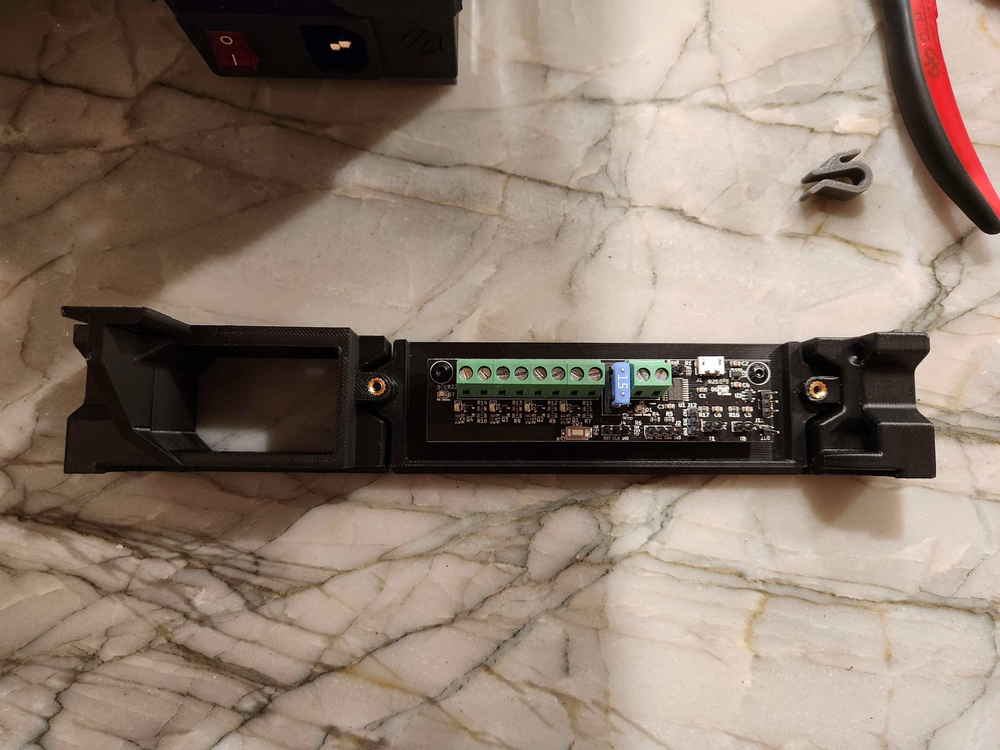
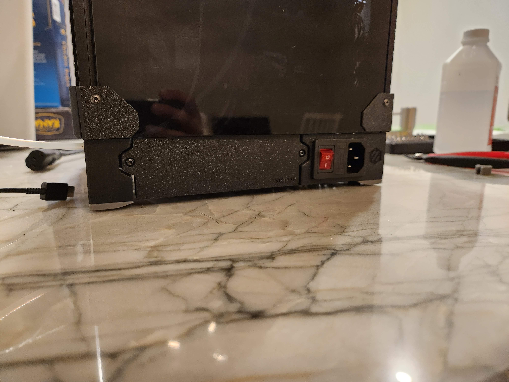

# V0 Trident Skirt Klipper Expander

This is a mod for MCMBen's [Trident skirt mod for V0](https://github.com/Fleafa/VoronUsers/tree/V0.1-Trident-skirt/printer_mods/MCMBen/Voron0_Trident_Skirt) that adds a mount for a [Klipper Expander](https://github.com/VoronDesign/Voron-Hardware/tree/master/Klipper_Expander). It also acts as a back skirt.

## BOM

In addition to the regular hardware needed for the Trident skirt mod, a couple of BOM leftovers are needed:

* M3x16 BHCS x1
* M3x8 BHCS x1
* M3x6 BHCS x2 (to mount the Klipper Expander)
* M3 Threaded Insert x2
