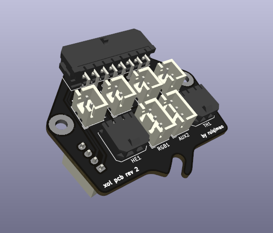
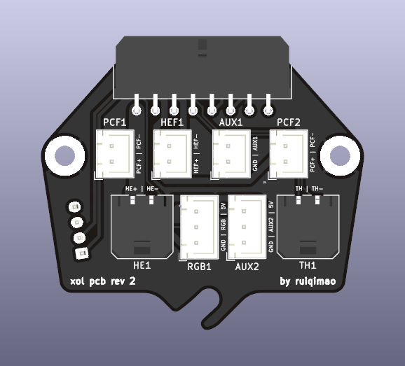
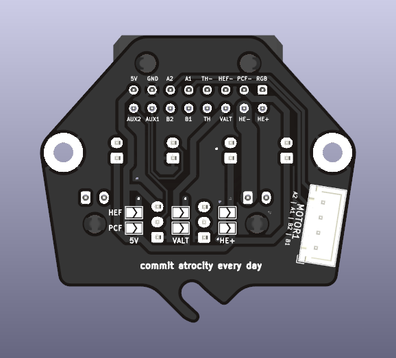
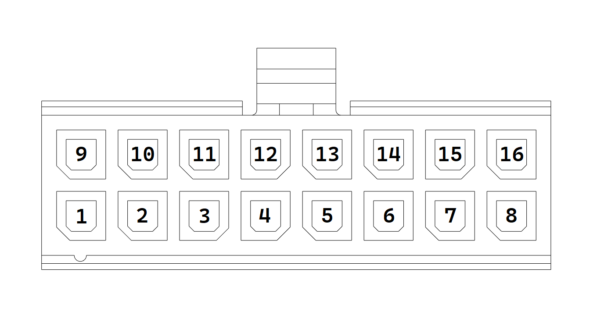

# Xol PCB

This is a PCB made for Armchair Engineering's [Xol Toolhead](https://github.com/Armchair-Engineering/Xol-Toolhead), featuring:
* One hotend cooling fan JST-XH connectors
* Two part cooling  fan JST-XH connectors
* One heater Micro-Fit connector
* One thermistor Micro-Fit connector
* One Neopixel JST-XH connector
* Two auxiliary JST-XH connectors
* One extruder motor connector
* Selectable fan voltage (5V, Alt, 24V)
* Integrated mount for carriage screw

## BOM

In addition to the PCB, the following connectors are needed:

| Part | Quantity | Link |
|:-:|:-:|:-:|
| Molex Micro-Fit 3.0 430451600 | 1 | [DigiKey](https://www.digikey.com/en/products/detail/molex/0430451600/531424) |
| Molex Micro-Fit 3.0 430650200 | 2 | [DigiKey](https://www.digikey.com/en/products/detail/molex/0436500200/268989) |
| JST B2B-XH-A | 4 | [DigiKey](https://www.digikey.com/en/products/detail/jst-sales-america-inc./B2B-XH-A(LF)(SN)/1651045) |
| JST B3B-XH-A | 2 | [DigiKey](https://www.digikey.com/en/products/detail/jst-sales-america-inc./B3B-XH-A/1651046) |
| JST B4B-XH-A | 1 | [DigiKey](https://www.digikey.com/en/products/detail/jst-sales-america-inc./B4B-XH-A(LF)(SN)/1651047) |

## Pinout

From the point of view looking directly at the **wiring harness connector**:

| Pin | Usage | Pin | Usage |
|:-:|:-:|:-:|:-:|
| 1 | Neopixel | 9 | Hotend Voltage |
| 2 | Part cooling fan ground | 10 | Hotend ground |
| 3 | Hotend fan ground | 11 | Alt voltage |
| 4 | Thermistor ground | 12 | Thermistor |
| 5 | Motor A1 | 13 | Motor B1 |
| 6 | Motor A2 | 14 | Motor B2 |
| 7 | Ground | 15 | Auxilary 1 |
| 8 | 5V | 16 | Auxiliary 2 |

## Selectable fan voltage

There are two sets of solder jumpers, one for each type of fan, that should be bridged to select the fan voltage.

## Extruder compatibility
The PCB and strain relief are designed with only the [Sherpa Mini](https://github.com/Annex-Engineering/Sherpa_Mini-Extruder) in mind. **Usage with other extruders may require the motor connector to be swapped to the back side.**

## Carabiner compatibility

The PCB is compatible with the Annex Engineering [wiring harness](https://store.annex.engineering/products/carabiner-wiring-harness) and [distribution PCB](https://github.com/Annex-Engineering/Annex_Engineering_PCBs/tree/master/carabiner-series-toolboard/carabiner-distributor).

Wire the distrbution PCB as labeled, with the following changes:

| Distribution PCB | Controller |
|:-:|:-:|
| Thermistor Chamber | Neopixel |
| Aux 1 | Ground |
| Aux 4 | 5V |

### Wiring harness compatibility

The 1200mm wiring harness may not be long enough for some printers. The following have been tested:

| Printer | Compatible |
|:-:|:-:|
| Trident 250mm | ? (Likely) |
| Trident 300mm | ? (Likely) |
| Trident 350mm | ? (Likely) |
| V2.4 250mm | Yes |
| V2.4 300mm | ? (Likely) |
| V2.4 350mm | ? (Unlikely) |

An alternative to the Annex harness is to purchase and repin a 14+2 Stealthburner wiring harness (e.g. [14-pin](https://www.fabreeko.com/products/ldo-v2-4-or-trident-ptfe-toolhead-cable-1-9m-350mm-sized-build?variant=43114275537151) + [2-pin](https://kb-3d.com/store/printer-specific-harnesses/474-linneo-led-extension-harness-voron-stealth-burner-1642910819052.html + [2x Molex Micro-Fit 3.0 0430251600](https://www.digikey.com/en/products/detail/molex/0430251600/531406?utm_adgroup=&utm_source=google&utm_medium=cpc&utm_campaign=PMax%20Supplier_Focus%20Supplier&utm_term=&utm_content=&gclid=EAIaIQobChMIsoGBzZrzgAMVJzmtBh1heQdKEAQYASABEgKG5PD_BwE))

## Beacon compatibility

The two AUX pins can be used for Beacon D- and D+ lines with some caveats:
* It is an untested use case
* There will be no more AUX pins left for endstop or filament sensors
* The traces are routed over ground plane splits
* 5V must be supplied from VBUS, meaning any fans running off of 5V will be powered by VBUS
